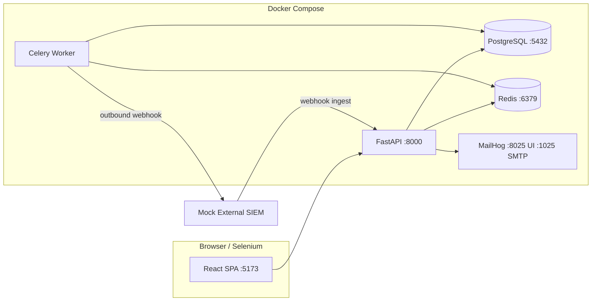
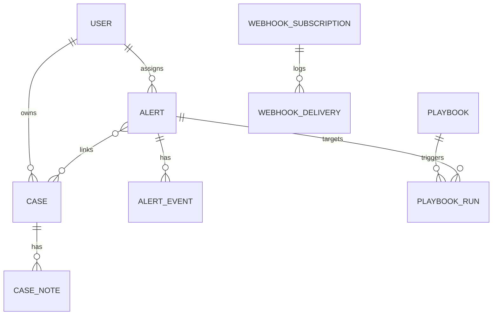

# SecOps Alert Triage Portal — Project Constitution

**Codename:** `SentinelDesk`  
**Version:** 1.0  
**Status:** Specification only (implementation follows epics in order)  
**Audience — implementation agent:** Product rules, domain model, testability hooks. Start with [IMPLEMENTATION_AGENT.md](./IMPLEMENTATION_AGENT.md).  
**Audience — QA engineer:** Test automation workflow in [TESTING_STRATEGY.md](./TESTING_STRATEGY.md) and `SENT-###-QA` tickets (implementation agent: ignore).

---

## 1. Executive summary

### 1.1 What we are building

**SentinelDesk** is a local, security-themed **Security Operations (SecOps) alert triage portal**. It simulates how a SOC team ingests suspicious events, triages them in a queue, groups them into cases, runs playbooks (automated response steps), and leaves an audit trail.

This is a **SecOps triage simulation** (not e-commerce). It uses enterprise-style workflows so you can practice test automation on realistic security operations scenarios.

### 1.2 Business goals (why this product exists)

| Goal | Success looks like | What testers validate |
|------|-------------------|------------------------|
| **Reduce mean time to triage (MTTT)** | Analysts can filter, sort, and disposition alerts quickly | Queue filters, bulk actions, keyboard shortcuts optional |
| **Consistent handling** | Playbooks apply the same steps for alert types | Playbook execution, status transitions, idempotency |
| **Accountability** | Every change is attributable | Audit log, user on each action, immutable history |
| **Safe escalation** | High-severity items require supervisor approval | RBAC, approval workflow, negative tests |
| **Integrate with tools** | External systems push alerts and receive webhooks | REST ingest API, outbound webhooks, async processing |

### 1.3 What you will practice (mapped to constitution)

| Practice area | Where it lives in SentinelDesk |
|---------------|-------------------------------|
| E2E UI (Selenium + pytest) | Login, queue, detail tabs, modals, date filters, iframe widget |
| REST API (pytest + httpx) | OpenAPI-documented ingest, triage, cases, playbooks |
| Integration (DB + API) | Verify API writes match DB; job completion updates rows |
| Async / flakiness handling | Background jobs, polling UI, webhook delivery retries |
| Non-functional (later) | Seed 10k alerts endpoint; p95 response targets documented |
| Bug garden | Documented defects; tests expected to fail until fixed |

---

## 2. Resettable test data (product capability)

**Implementation agent:** Reset **API** is delivered in **E10 / SENT-1001** only. Until then, implement `scripts/seed.py` (CLI re-seed) per tickets — do not add `POST /api/v1/test/reset` early. QA uses manual re-seed ([TEST_DATA.md](./TEST_DATA.md) §5 Option B/C) before E10.

**QA engineer:** Full reset workflow below; API reset and `clean_db` fixture apply **after SENT-1001** (app) + **SENT-1002-QA** (fixture).

**Resettable test data** means: before (or after) a test run, the application can return to a **known baseline** so automation does not break because yesterday’s manual testing created random alerts.

### 2.1 The problem without reset

- E2E test expects: “Login as `analyst@demo.local`, queue shows **exactly 3** open alerts.”
- You manually triaged one alert yesterday → queue shows 2 → test fails (false negative).
- Parallel tests create duplicate cases → tests flake.

### 2.2 The solution (built into SentinelDesk)

| Mechanism | Purpose |
|-----------|---------|
| **`scripts/seed.py`** | Loads fixed users, alerts, cases, playbook definitions (CLI — available from E01/E02 seed tickets) |
| **`POST /api/v1/test/reset`** (admin-only, non-prod) | Truncates data tables and re-runs seed — **E10 / SENT-1001** |
| **`docker compose` volume reset** (optional nuclear option) | Fresh PostgreSQL volume |
| **Stable IDs in seed** | Fixed UUIDs + `external_id` strings — canonical table in [TEST_DATA.md](./TEST_DATA.md) §3 (e.g. `ALERT_OPEN_HIGH` ↔ `seed-edr-001`) |

### 2.3 How QA uses reset (by phase)

**Before E10 (no reset API yet):**

```text
docker compose up -d
docker compose exec api python -m scripts.seed   # Option B — see TEST_DATA.md
pytest tests/api tests/integration
```

**After SENT-1001 (reset API) + SENT-1002-QA (`clean_db` fixture):**

```text
docker compose up -d
pytest tests/e2e   # clean_db fixture calls POST /api/v1/test/reset when configured
```

**Rule for automation:** Tests should **not** depend on data from a previous run unless created and cleaned up in the same test. Before E10, manual re-seed; after E10, prefer `clean_db` or reset API — see `docs/TEST_DATA.md`.

---

## 3. Technology decisions

### 3.1 Stack (fixed for this constitution)

| Layer | Choice | Rationale |
|-------|--------|-----------|
| Backend | **Python 3.12+**, **FastAPI** | OpenAPI for API tests; async support; familiar to pytest users |
| ORM / migrations | **SQLAlchemy 2**, **Alembic** | Integration tests can query DB; migrations versioned |
| Database | **PostgreSQL 16** (Docker) | Reliable, realistic, good for integration tests; not SQL Server |
| Job queue | **Redis 7** + **Celery** (or ARQ if simpler) | Background playbooks, webhook retries |
| Frontend | **React 18** + **Vite** + **TypeScript** | Rich UI patterns (tabs, modals, tables); iframe page for “Threat Intel” |
| Email simulation | **MailHog** (Docker, free) | Capture outbound mail; no real SMTP |
| SMS | **UI mock only** (no Twilio) | Show “SMS sent” toast + DB notification row |
| API docs | Swagger at `/docs` | Contract testing reference |
| Test hooks | `data-testid` on all interactive elements | Selenium stability |

### 3.2 Why PostgreSQL in Docker (not SQL Server Management Studio)

| Option | Verdict |
|--------|---------|
| **Docker + PostgreSQL** | **Recommended.** One `docker compose up`, same on any machine, easy reset, matches most cloud deployments. |
| **SQL Server + SSMS** | Possible on Windows but heavier install, different SQL dialect, less common in Python OSS tutorials. |
| **SQLite** | Too simple for async/job integration realism; poor concurrent write behavior for parallel tests. |

**For you:** Use **Docker Desktop** + **docker compose**. Use **pgAdmin** or **DBeaver** (free) if you want a GUI like SSMS. You do not need SSMS for this project.

### 3.3 Local runtime topology



### 3.4 Repository layout (target)

```text
sentinel-desk/
├── docker-compose.yml
├── .env.example
├── backend/
│   ├── app/
│   │   ├── api/          # route modules
│   │   ├── core/         # config, security
│   │   ├── models/       # SQLAlchemy
│   │   ├── schemas/      # Pydantic
│   │   ├── services/     # business logic
│   │   ├── workers/      # Celery tasks
│   │   └── main.py
│   ├── alembic/
│   └── scripts/seed.py
├── frontend/
│   └── src/              # React SPA — no tests/ folder here
├── pytest.ini            # QA test runner config (repo root)
├── requirements-test.txt # QA Python deps (httpx, not requests)
├── tests/                # ALL automated tests (QA-owned)
│   ├── conftest.py
│   ├── api/
│   ├── integration/
│   ├── data/             # static JSON for negative tests
│   └── e2e/              # Selenium — bootstrapped SENT-107-QA; enhanced SENT-1003-QA
├── docs/
│   ├── CONSTITUTION.md
│   ├── ARCHITECTURE.md
│   ├── TESTING_STRATEGY.md
│   ├── TEST_DATA.md
│   ├── BUG_GARDEN.md
│   ├── epics/
│   └── tickets/          # Jira-style tickets per epic (E01–E11)
└── mock-siem/
```

### 3.5 Test code policy

| Rule | Detail |
|------|--------|
| **Single test root** | All pytest and Selenium code lives under repository root `tests/` only |
| **No tests in app packages** | `backend/` and `frontend/` must **not** contain `tests/` folders or test modules |
| **Who writes tests** | **QA engineer** (human), ticket-by-ticket, via paired `SENT-###-QA` tickets — not the implementation agent |
| **Who builds the app** | **Implementation agent** on `SENT-###` tickets only — features + `data-testid` hooks; **never** files under `tests/` |

**Why the layout originally showed extra `tests/` folders:** Many Python and React repos colocate developer unit tests next to source (`backend/tests`, `frontend/tests`). That is a valid **dev** pattern, but it splits automation across the tree and blurs ownership. For this project, the **QA engineer** owns all automation in one place; **dev unit tests are out of scope**, so colocated folders were removed to avoid accidental test generation inside the app.

### 3.6 Test harness phases (QA-owned vs app-owned)

The pytest harness is **never** built by the implementation agent. Do not create or edit `tests/`, `pytest.ini`, or `conftest.py` on `SENT-###` tickets.

| Phase | Owner | Delivered by | Scope |
|-------|-------|--------------|-------|
| **Foundation** | QA engineer | E01 `-QA` tickets (e.g. SENT-101-QA, SENT-102-QA) | Root `tests/`, `pytest.ini`, `conftest.py`, `tests/api/`, `tests/integration/`, `tests/data/` |
| **Per-epic tests** | QA engineer | E02–E09 `-QA` tickets | Add `test_*.py` (API/integration); UI epics add `tests/e2e/` cases after SENT-107-QA bootstrap |
| **E10 app hooks** | Implementation agent | SENT-1001, SENT-1004 | Reset API; plant bug-garden defects in **app code** |
| **E10 harness extensions** | QA engineer | SENT-1001-QA, SENT-1002-QA, SENT-1003-QA, SENT-1004-QA | `admin_api_client`, `clean_db`; **SENT-1003-QA** standardizes Selenium POM (does not first-create `tests/e2e/`) |

**Rule for implementation agents:** If `tests/` exists, treat it as read-only. E10 does **not** mean “bootstrap pytest” — see [IMPLEMENTATION_AGENT.md](./IMPLEMENTATION_AGENT.md).

---

## 4. Roles and permissions (3 roles)

| Role | Code | Typical user (seed) | Can do | Cannot do |
|------|------|---------------------|--------|-----------|
| **Analyst** | `ANALYST` | `analyst@demo.local` | View/triage alerts, comment, run non-destructive playbooks, create cases | Approve escalations, edit global rules, reset test data |
| **Lead** | `LEAD` | `lead@demo.local` | Everything analyst + reassign, close cases, approve escalations, bulk disposition | Manage users/rules, reset test data |
| **Admin** | `ADMIN` | `admin@demo.local` | User/rule/playbook admin, audit export, test reset endpoint | N/A |

All passwords in seed: documented in `docs/TEST_DATA.md` (e.g. `DemoPass123!`).

---

## 5. Domain model (entities)



| Entity | Description | Key fields |
|--------|-------------|------------|
| `User` | Portal account | email, role, active |
| `Alert` | Single ingested event | external_id, source, severity, status, title, ioc_list, assigned_to, sla_due_at |
| `AlertEvent` | Timeline entry | alert_id, event_type, payload, created_by |
| `Case` | Container for investigation | case_number, status, priority, lead_id |
| `CaseAlert` | M2M link | case_id, alert_id |
| `CaseNote` | Human notes | case_id, body, author_id |
| `Playbook` | Template of steps | name, trigger_severity, steps_json |
| `PlaybookRun` | Execution instance | status PENDING/RUNNING/SUCCESS/FAILED |
| `AuditLog` | Immutable | actor, action, entity_type, entity_id, diff |
| `WebhookSubscription` | Outbound config | url, secret, events[] |
| `WebhookDelivery` | Attempt log | status, response_code, retry_count |
| `Notification` | Email/SMS record | channel, recipient, subject, status |

### 5.1 Alert lifecycle (state machine)

```text
NEW → TRIAGING → [FALSE_POSITIVE | TRUE_POSITIVE | ESCALATED]
ESCALATED → (Lead approves) → CLOSED
Any non-terminal → MERGED (linked to case; terminal)
```

### 5.2 Domain status enums (canonical — do not mix)

**AlertStatus** (`alerts.status`) — SOC disposition on the event:

| Value | Terminal? | Meaning |
|-------|-----------|---------|
| `NEW` | no | Ingested; not yet triaged |
| `TRIAGING` | no | Analyst actively working |
| `FALSE_POSITIVE` | **yes** | Benign / not a threat |
| `TRUE_POSITIVE` | **yes** | Confirmed issue; handled or tracked |
| `ESCALATED` | no | Awaiting lead approval |
| `CLOSED` | **yes** | Lead approved closure after escalation (or lead disposition to close) |
| `MERGED` | **yes** | Linked into a case; no further triage on queue |

**Bulk assign / playbook run:** reject alerts in **terminal** statuses (`FALSE_POSITIVE`, `TRUE_POSITIVE`, `CLOSED`, `MERGED`) with `INVALID_STATE`.

**CaseStatus** (`cases.status`) — investigation container (**separate enum from AlertStatus**):

| Value | Terminal? | Who may set `CLOSED` |
|-------|-----------|----------------------|
| `OPEN` | no | — |
| `IN_PROGRESS` | no | — |
| `CLOSED` | **yes** | **LEAD+ only** (see E05) |

**PlaybookRunStatus** (`playbook_runs.status`) — async job UI/API:

| Value | Notes |
|-------|-------|
| `PENDING`, `RUNNING`, `SUCCESS`, `FAILED` | Public API + OpenAPI — map Celery `FAILURE` → `FAILED` internally |

**Alert.enrichment_status** (separate column, not `AlertStatus`): `PENDING` → `COMPLETE` after worker enrich (E02).

### 5.3 Severity and sources (seed enums)

- **Severity:** `LOW`, `MEDIUM`, `HIGH`, `CRITICAL`
- **Source:** `EDR`, `IDS`, `PHISHING_SIM`, `USER_REPORT`, `THREAT_INTEL_FEED` — see **Glossary** for meanings

---

## 6. Application modules

| # | Module | Business capability | Primary pages/APIs |
|---|--------|---------------------|-------------------|
| M1 | **Identity & access** | Login, JWT Bearer, RBAC | `/login`, `/api/v1/auth/*` |
| M2 | **Alert ingestion** | Accept alerts from API/webhook | `POST /api/v1/alerts/ingest`, mock SIEM |
| M3 | **Triage queue** | Filter, sort, paginate, bulk assign | `/alerts`, queue APIs |
| M4 | **Alert detail** | Multi-tab view, timeline, IOCs | `/alerts/:id` (tabs) |
| M5 | **Case management** | Link alerts, notes, status | `/cases`, `/cases/:id` |
| M6 | **Playbooks** | Async execution, polling status | `/playbooks`, run modal |
| M7 | **Webhooks** | Outbound notifications on events | Admin + delivery log |
| M8 | **Reporting** | Dashboard KPIs | `/dashboard` |
| M9 | **Audit & compliance** | Exportable audit trail | `/audit` |
| M10 | **Admin** | Users, rules, subscriptions | `/admin` |
| M11 | **Notifications** | MailHog email + UI SMS mock | worker tasks |
| M12 | **Threat intel iframe** | Embedded third-party widget (mock) | tab on alert detail |

---

## 7. Pages (automation targets — minimum 8)

| Page | Route | Role gate | UI patterns to implement |
|------|-------|-----------|--------------------------|
| P1 Login | `/login` | public | form validation, error toast |
| P2 Dashboard | `/dashboard` | all | charts/cards, date range picker |
| P3 Alert queue | `/alerts` | analyst+ | **data table**, pagination, **rich filters**, bulk modal |
| P4 Alert detail | `/alerts/:id` | analyst+ | **multi-tab** (Summary, Timeline, IOCs, Related), **iframe** tab |
| P5 Case list | `/cases` | analyst+ | table, status badges |
| P6 Case detail | `/cases/:id` | analyst+ | tabs, notes modal, linked alerts |
| P7 Playbooks | `/playbooks` | analyst+ | list, **run playbook modal**, **async polling** banner |
| P8 Audit log | `/audit` | lead+ | table, export CSV, date filter |
| P9 Admin | `/admin` | admin | users CRUD, rules, webhook subscriptions |

**Selenium convention:** every page exposes `data-testid="page-<name>"`.

---

## 8. Async behavior (flakiness practice by design)

| Feature | Behavior | Tester notes |
|---------|----------|--------------|
| Ingest → process | API returns `202 Accepted`, worker enriches alert (tags, SLA) | Poll `GET /api/v1/alerts/{id}` until `enrichment_status=COMPLETE` |
| Playbook run | Celery task steps with 2–5s delay | UI polls `GET /api/v1/playbook-runs/{id}` until `SUCCESS` or `FAILED` |
| Outbound webhook | Retries 3x with backoff on 500 from mock SIEM | Check `webhook_deliveries` table |
| Dashboard KPIs | Cached 30s in Redis | Values may lag; document in BUG_GARDEN optional race |
| Queue auto-refresh | Frontend polls every 10s | Stale element risk — use stable selectors |

---

## 9. Non-functional requirements (for later testing)

Not implemented day one, but architecture must **allow**:

| NFR ID | Requirement | Target (portfolio phase) |
|--------|-------------|---------------------------|
| NFR-01 | Alert queue API p95 latency | < 500ms with 10k alerts seeded |
| NFR-02 | Ingest throughput | 100 alerts/min sustained (worker scale) |
| NFR-03 | Concurrent analysts | 20 without DB deadlock on assign |
| NFR-04 | Session security | JWT access token **8h** expiry; client stores in `sessionStorage` (demo — not HttpOnly cookies) |
| NFR-05 | Audit retention | No hard delete of audit rows |

Seed script will include `POST /api/v1/dev/seed-bulk?count=10000` (admin, non-prod only).

---

## 10. Bug garden policy

Known defects are **intentional** for test practice. Each bug has:

- `BUG-###` id in `docs/BUG_GARDEN.md`
- Linked sample ticket “Verify fix for BUG-###”
- pytest marker `@pytest.mark.bug("BUG-001")` expected **xfail** until fixed

**Phase 1:** Ship 5–8 bugs after core features stable.  
**Phase 2:** Your failing tests become the “fix list.”

---

## 11. Notifications (free, no real PII)

| Channel | Implementation |
|---------|----------------|
| Email | Celery sends via SMTP to **MailHog** (`mailhog:1025`); view at `http://localhost:8025` |
| SMS | No external provider; create `Notification` row + UI toast “SMS simulated to +1-555-***” |

Never use real email addresses or phone numbers in seed — only `@demo.local` and fictional numbers.

---

## 12. Testability contract (mandatory for implementers)

### 12.1 Selectors

- All buttons, inputs, rows: `data-testid="<area>-<action>"` (kebab-case).
- Example: `data-testid="alert-queue-filter-severity"`.

### 12.2 API contracts

- OpenAPI 3.1 generated from FastAPI.
- Error shape: `{ "error": { "code", "message", "details" } }`.

### 12.3 Stable seed IDs

All fixed **`id` (UUID)**, **`external_id`**, and QA constant names (`ALERT_OPEN_HIGH`, etc.) are defined in [TEST_DATA.md](./TEST_DATA.md) §3. Do not change without updating tests.

- **API / DB tests:** use UUID constants (`ALERT_OPEN_HIGH`, …).
- **Ingest tests:** use `external_id` values (`seed-edr-001`, …) — each maps to a fixed UUID in seed.

### 12.4 Iframe

Alert detail → **Threat Intel** tab loads `http://localhost:8090/embed` (mock static server). Tests must `driver.switch_to.frame(...)`.

---

## 13. Epic roadmap (implementation order)

| Epic | Name | Outcome |
|------|------|---------|
| E01 | Platform foundation | Docker, DB, auth, RBAC |
| E02 | Alert ingestion | API + mock SIEM + async enrichment |
| E03 | Triage queue UI | Table, filters, pagination, bulk |
| E04 | Alert detail | Tabs, timeline, iframe |
| E05 | Case management | CRUD, linking, notes |
| E06 | Playbooks & async | Celery, polling UI |
| E07 | Webhooks | Outbound deliveries + retries |
| E08 | Dashboard & audit | KPIs, audit export |
| E09 | Admin & notifications | MailHog, rules, users |
| E10 | Test harness & bug garden | Reset API + planted bugs (app); harness extensions (QA) |
| E11 | Portfolio scale | bulk seed, NFR hooks, perf scripts |

Epic details: `docs/epics/`. Implementation and QA tickets: `docs/tickets/E01/` … `docs/tickets/E11/`.

---

## 14. Next steps

### For the implementation agent

1. Read [IMPLEMENTATION_AGENT.md](./IMPLEMENTATION_AGENT.md) first.  
2. Implement `SENT-###` tickets in epic order — **skip all `-QA` tickets**.  
3. Never create or modify files under `tests/`, `pytest.ini`, or `requirements-test.txt`.  

When prompted: **“Implement SENT-101”** or **“Implement SENT-104”** — app code only.

### For the QA engineer (separate workflow)

1. After each app story is runnable, complete the paired `SENT-###-QA` ticket using [TESTING_STRATEGY.md](./TESTING_STRATEGY.md).  
2. **E10 QA** extends the harness (`clean_db`, Selenium POM, xfail tests); **E10 app** (implementation agent) delivers reset API + planted bugs only.  
3. **E11** adds portfolio-scale hooks and performance practice.

---

## 15. Glossary

| Term | Meaning |
|------|---------|
| IOC | Indicator of Compromise (IP, hash, domain, URL) |
| MTTT | Mean Time To Triage |
| Playbook | Automated checklist triggered on an alert |
| SOC | Security Operations Center |
| Triage | Prioritize and classify an alert |
| SIEM | Security Information and Event Management (simulated here) |
| **Alert source** | The **origin system or channel** that produced the alert — not a code module. Tells the analyst *where the signal came from* and often implies different handling. |
| **EDR** (source) | *Endpoint Detection and Response* — alert from an endpoint agent (workstation/server), e.g. suspicious process execution |
| **IDS** (source) | *Intrusion Detection System* — network or host IDS signature (e.g. exploit attempt, port scan) |
| **PHISHING_SIM** (source) | Simulated phishing exercise (training platform), not a live attack — usually lower urgency unless policy says otherwise |
| **USER_REPORT** (source) | Human-submitted report (e.g. “suspicious email” button, helpdesk ticket converted to alert) |
| **THREAT_INTEL_FEED** (source) | External intelligence (IOC match, threat feed correlation) — often enriches other alerts rather than standing alone |
